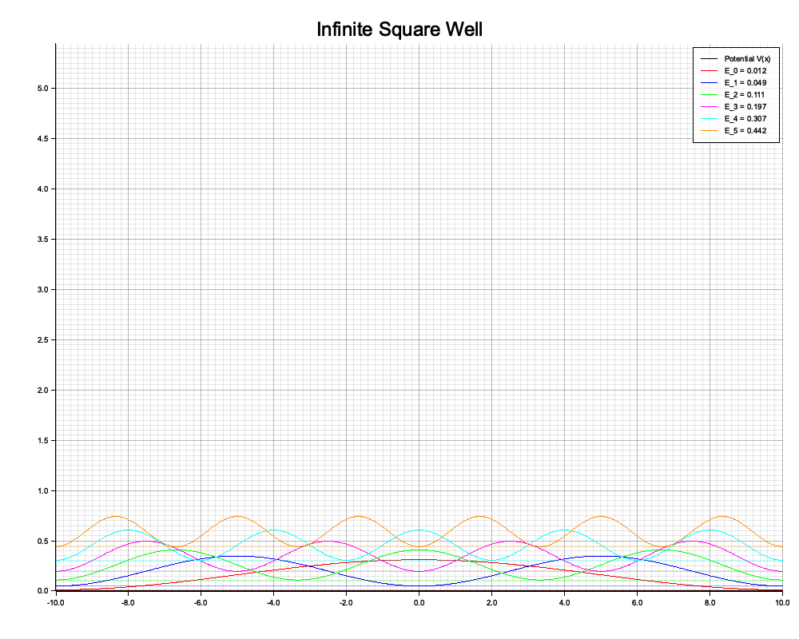
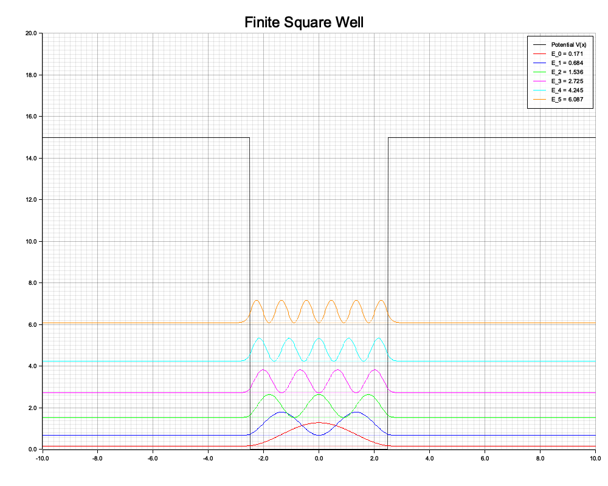
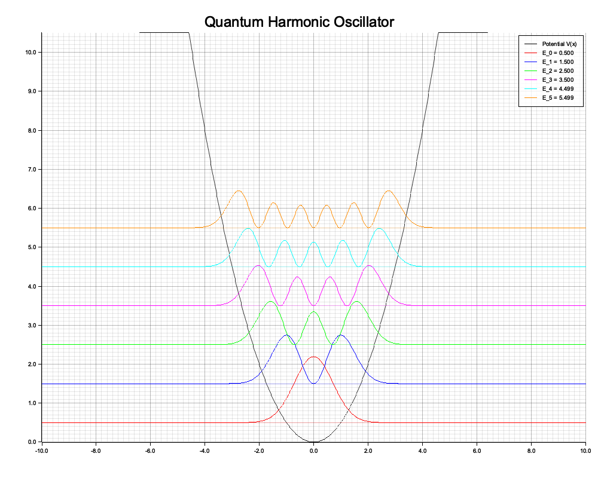

# Quantum Physics Simulation

## Summary of Changes
- Created a new Rust project `quantum_sim` with dependencies `nalgebra` and `plotters`.
- Built a straightforward matrix eigenvalue solver using Central Finite Differences to represent the $-\frac{\hbar^2}{2m} \frac{d^2}{dx^2}$ kinetic energy operator.
- Formulated physical geometries mapping the **Infinite Square Well**, **Finite Square Well**, and **Quantum Harmonic Oscillator**.
- Used `nalgebra`'s `SymmetricEigen` to solve the Hamiltonian block, subsequently normalizing the first 6 eigenstates array components.
- Superimposed and color-mapped probability densities $|\psi_n(x)|^2$, shifting them vertically by $E_n$.

## Visual Results
The plots correctly reflect quantum physics behaviors—the lower energy wavefunctions maintain few nodes (wiggles) and restrict closely inside the potential barriers, whereas the higher energy states permeate further outward and exhibit a larger number of nodes.

## Validation Methods Tested
- Automated tests using `cargo run` accurately completed computations.
- Inspected the zero-boundary vanishing limits and boundary penetrations. As predicted, the wave packet penetrates inside the wall regions in the **Finite Square Well** and **Harmonic Oscillator**, but strictly zeroes out at the boundary of the **Infinite Square Well**.
- Evaluated proper node counting; the $n$-th energy eigenstate accurately demonstrates $n$ zeros.
