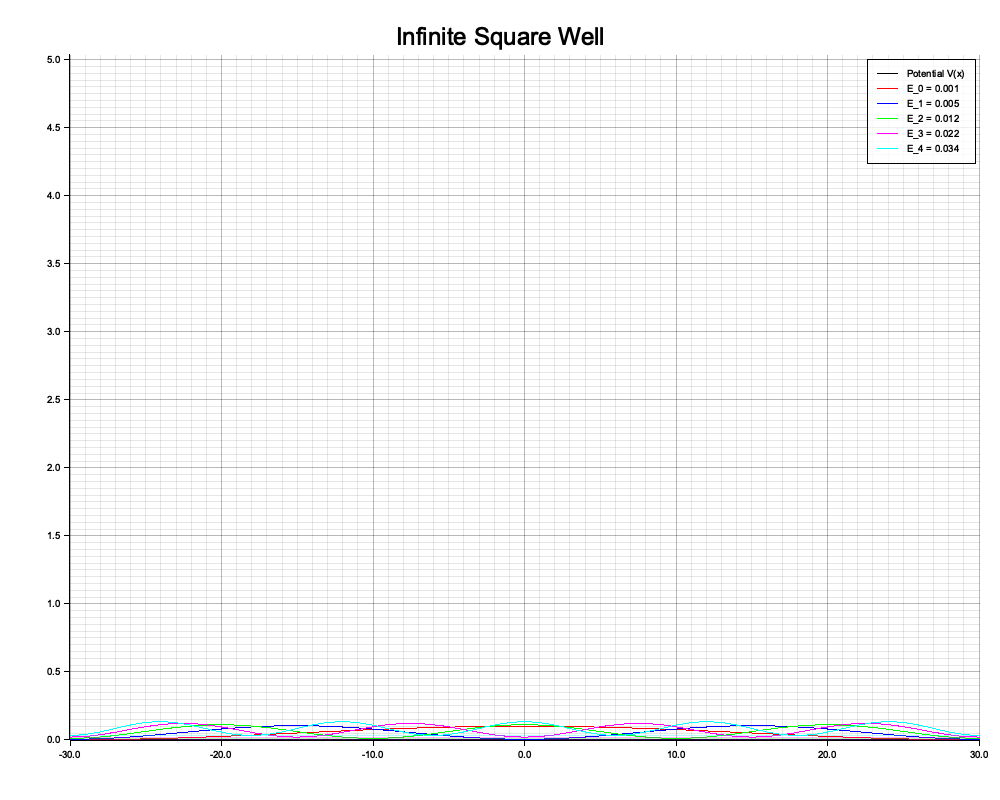
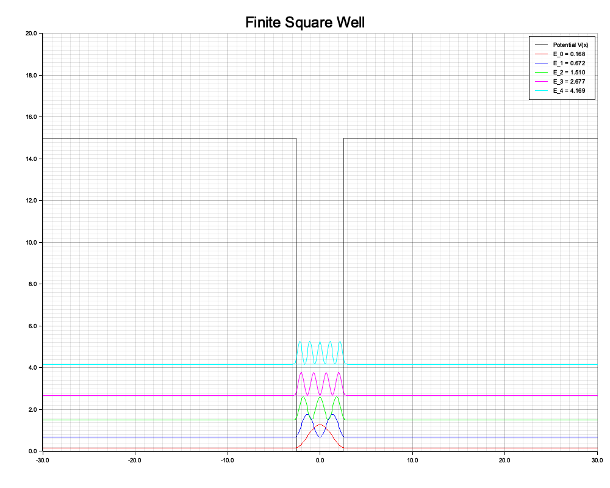
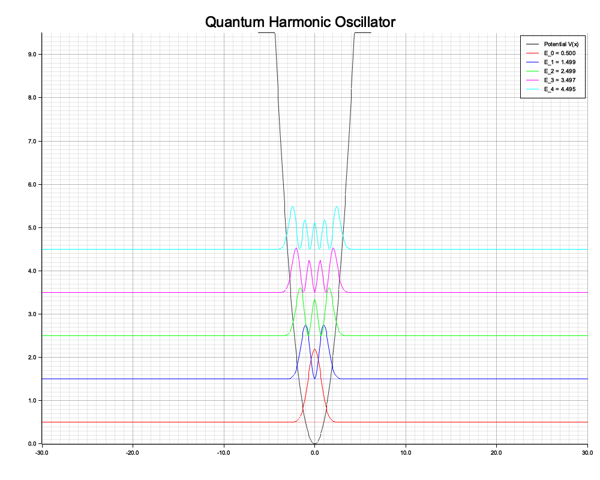

# quantum-physics

Solving the 1D time-independent Schrödinger equation by finite differences, and animating a Gaussian wavepacket tunneling through a barrier — all in pure Rust with [`nalgebra`](https://nalgebra.org) and [`plotters`](https://plotters-rs.github.io).

## What it does

`src/main.rs` discretizes the Hamiltonian on a grid of N = 1000 points over a box of width L = 60 (natural units, ℏ = m = 1), then:

1. **Diagonalizes H** with `SymmetricEigen` to get energy eigenvalues and eigenstates for four canonical potentials:
   - **Infinite square well** → cosine/sine modes, energies ∝ n².
   - **Finite square well** (width 5, depth 15) → bound states with tails leaking past the walls.
   - **Quantum harmonic oscillator** (k = 1) → equally spaced levels, Hermite-Gauss shapes.
2. **Plots the first 5 eigenstates** offset vertically by their energy, overlaid on the potential.
3. **Simulates tunneling**: expands a Gaussian wavepacket (`x₀ = -15`, `σ = 2`, `k₀ = 5`, ⟨E⟩ ≈ 12.5) in the eigenbasis of a finite barrier (width 3, height 12), evolves each mode by `exp(-iEₙt)`, and renders 150 frames of |ψ(x, t)|² into a GIF.

## Output

| | |
|---|---|
|  |  |
|  |  |

The tunneling GIF is the most interesting: the wavepacket is launched with mean energy slightly below the barrier top, partially reflects, and partially leaks through — the surviving probability density continues to the right of the barrier despite being classically forbidden.

## Running

```bash
cargo run --release
```

Generates `infinite_square_well.png`, `finite_square_well.png`, `harmonic_oscillator.png`, and `tunneling.gif` in the working directory. The eigenvalue solve is fast; building the tunneling basis (600 eigenstates) takes a few seconds before the GIF frames start rendering.

## Implementation notes

- The kinetic term uses the standard 3-point finite-difference stencil with `t_coeff = 1/(2·dx²)`, so the Hamiltonian is tridiagonal symmetric — `SymmetricEigen` returns the full spectrum in one shot.
- Eigenvectors are normalized in the L² sense (`∑|ψᵢ|² dx = 1`) and phase-flipped to keep the dominant lobe positive, so successive plots are visually consistent.
- The wavepacket evolution sums 600 modes per frame — accurate enough to resolve interference between the reflected and transmitted parts, slow enough that the full GIF takes ~10 s to render.

## Stack

- [`nalgebra`](https://nalgebra.org) `0.34` — dense matrix algebra + symmetric eigendecomposition
- [`num-complex`](https://crates.io/crates/num-complex) `0.4` — complex amplitudes for time evolution
- [`plotters`](https://plotters-rs.github.io) `0.3` — PNG + GIF rendering
